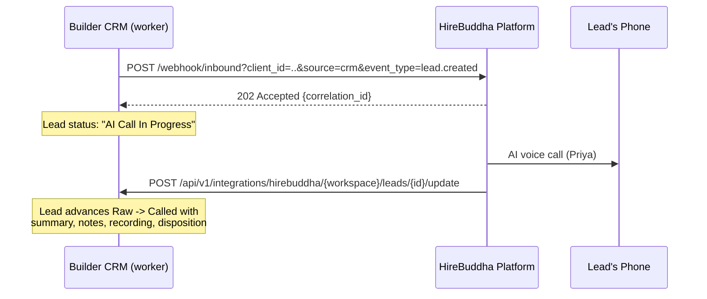

# HireBuddha AI Calling Agent — CRM Integration

**Provider:** HireBuddha AI Agent Platform (`https://app.hirebuddha.com`)
**Agent:** Priya — Real Estate Sales Expert (Entity ID `65b0ec26-42c1-4a63-b03e-68692ee30c9b`)
**Company:** Fortune (Company ID `3ffe9166-8dae-4488-a6a4-387dad47f3f7`)
**Guide implemented:** "HireBuddha — CRM Voice Automation Integration Guide" v1.0 (May 5, 2026)

---

## How it works



1. **CRM → HireBuddha (dispatch).** The AI-agent background worker sweeps every
   workspace on its configured cadence (`Raw Leads → Configure`). When a
   workspace's voice provider is `hirebuddha`, each pending Raw Lead is posted
   to HireBuddha's inbound webhook as a `lead.created` event. The lead parks in
   **AI Call In Progress** with the returned `correlation_id`.
2. **HireBuddha → CRM (callback).** After the call, HireBuddha posts the result
   to our CRM Update API. Connected calls advance the lead **Raw → Called**
   with every call detail stored; `no_answer`/`busy` re-queue the lead within
   the retry budget; `invalid_number` halts it.
3. If no callback arrives within `HIREBUDDHA_CALLBACK_TIMEOUT_MINUTES`
   (default 30), the lead is re-queued automatically.

Every HTTP exchange — each dispatch attempt and each callback — is stored in
the per-workspace `integration_logs` table and mirrored into the audit trail.

---

## Configuration

### Server environment (deploy/.env)

| Variable | Default | Purpose |
|---|---|---|
| `HIREBUDDHA_ENABLED` | `1` | Master switch for outbound dispatch |
| `HIREBUDDHA_BASE_URL` | `https://app.hirebuddha.com` | Platform base URL |
| `HIREBUDDHA_CLIENT_ID` | Fortune company UUID | Default `client_id` query parameter |
| `HIREBUDDHA_ENTITY_ID` | Priya agent UUID | Default `entity_id` (which AI agent dials) |
| `HIREBUDDHA_CALLBACK_TOKEN` | *(empty — fail closed)* | Shared secret for inbound callbacks. Generate: `openssl rand -hex 32` |
| `HIREBUDDHA_HTTP_TIMEOUT_SECONDS` | `15` | Outbound request timeout |
| `HIREBUDDHA_HTTP_RETRIES` | `3` | HTTP attempts per dispatch (5xx/network only) |
| `HIREBUDDHA_CALLBACK_TIMEOUT_MINUTES` | `30` | Re-queue window for lost callbacks |

### Per-workspace settings (Raw Leads → Configure, admin only)

- **Voice provider** — `Built-in Simulation` (default; no real calls) or
  `HireBuddha AI Voice Agent`. **Switching to HireBuddha starts real outbound
  phone calls to every pending Raw Lead in that workspace.**
- **Company ID / Agent ID overrides** — for workspaces mapped to a different
  HireBuddha company or agent; blank uses the global defaults above.
- The existing cadence controls (interval, batch size, retry limit) apply to
  HireBuddha dispatching exactly as they did to the simulator.

---

## 1. CRM → HireBuddha (outbound)

```
POST {HIREBUDDHA_BASE_URL}/webhook/inbound
     ?client_id={company_uuid}&source=crm&event_type=lead.created&entity_id={agent_uuid}
Content-Type: application/json
```

```json
{
  "crm_event": "lead.created",
  "id": "PL-1042",
  "properties": {
    "first_name": "Rahul",
    "last_name": "Sharma",
    "phone": "+919876543210",
    "email": "rahul@example.com",
    "project_interested": "Sunrise Heights",
    "ad_source": "Google Ads",
    "budget_range": "₹90 Lakhs",
    "created_at": "2026-07-20T10:00:00Z"
  }
}
```

- Phone numbers are normalized to E.164 (`+91` + 10 digits). Leads without a
  dialable 10-digit number are halted (`Invalid Number - Halted`) instead of
  dispatched.
- A `202` acceptance moves the lead to `AI Call In Progress` and records the
  `correlation_id`. HireBuddha deduplicates on the lead `id`, so a re-dispatch
  after a lost callback is safe.
- Failures retry within the workspace retry budget
  (`Dispatch Failed - Retry Scheduled` → `Max Call Attempts Reached`).
- Admins can push a single lead immediately (test-lead verification):
  `POST /api/v1/integrations/hirebuddha/dispatch/{lead_id}`.

## 2. HireBuddha → CRM (CRM Update API)

Share this configuration with the HireBuddha team:

| Item | Value |
|---|---|
| **API URL** | `https://builder.durwankur.com/api/v1/integrations/hirebuddha/{workspace_id}` |
| **Update Endpoint Pattern** | `/leads/{lead_id}/update` |
| **Authentication** | `Bearer Token` (or `X-API-Key` header) |
| **Auth Credential** | The `HIREBUDDHA_CALLBACK_TOKEN` value (share securely, never in email/chat plaintext) |

`{workspace_id}` is the CRM workspace the leads belong to (e.g. `tenant-1`);
one HireBuddha "CRM Update API" configuration per workspace.

Accepted payload (v1.0 contract; unknown extra fields ignored):

```json
{
  "lead_id": "PL-1042",
  "call_status": "completed",
  "call_outcome": "interested",
  "call_summary": "Confirmed budget 90L-1Cr, site visit Saturday 11 AM.",
  "ai_notes": "Prefers east-facing. Send brochure on WhatsApp.",
  "call_duration": 245,
  "call_recording_url": "https://recordings.hirebuddha.com/abc.mp3",
  "next_action": "site_visit_scheduled",
  "next_action_date": "2026-07-26T11:00:00+05:30",
  "lead_temperature": "hot",
  "updated_at": "2026-07-20T12:00:00+05:30",
  "updated_by": "hirebuddha_agent"
}
```

Outcome handling:

| `call_outcome` | CRM effect |
|---|---|
| `interested`, `callback_requested` | Raw → **Called**, interest `Interested` |
| `not_interested` | Raw → **Called**, interest `Not Interested` |
| `no_answer`, `busy` | Stays Raw, `Call Failed - Retry Scheduled` (re-dialled within retry budget) |
| `invalid_number` | Stays Raw, `Invalid Number - Halted` (never re-dialled) |

Stored on the lead: call status, duration, recording URL, summary, AI notes,
disposition (verbatim outcome), lead temperature, next follow-up date/time,
and the callback timestamp — plus a history entry and an audit-log row.

Responses: `200` (applied, or acknowledged-and-ignored for a duplicate/late
callback), `401` bad token, `404` unknown workspace/lead, `422` payload
outside the documented contract. HireBuddha treats any `2xx` as delivered.

---

## Troubleshooting & audit

- **Integration logs (per workspace, admin):**
  `GET /api/v1/integrations/hirebuddha/logs?direction=outbound|inbound&lead_id=PL-1042`
  — one row per HTTP attempt with full request/response payloads and errors.
- **Audit trail:** every dispatch, callback, and re-queue writes to the
  standard `audit_logs` (visible in the Admin Console).
- **Lead history:** each lead's history modal shows its dispatch/callback
  timeline.

### Test procedure

1. In a test workspace, set the provider to HireBuddha (Raw Leads → Configure).
2. Create a Raw Lead with **your own phone number**.
3. `POST /api/v1/integrations/hirebuddha/dispatch/{lead_id}` (or press
   *Run Cycle Now*) — expect a call within ~30 seconds.
4. After the call, confirm the lead moved to Called Leads with the summary,
   recording link and temperature, and check the integration logs.

Simulating a callback without a real call:

```bash
curl -X POST "http://localhost:8000/api/v1/integrations/hirebuddha/tenant-1/leads/PL-1042/update" \
  -H "Authorization: Bearer $HIREBUDDHA_CALLBACK_TOKEN" \
  -H "Content-Type: application/json" \
  -d '{"call_outcome":"interested","call_summary":"Test callback","lead_temperature":"hot","call_duration":120}'
```

---

## Out of scope (owed to HireBuddha separately)

The guide also asks for a **WhatsApp send-message API**, **Google Calendar
OAuth credentials**, and **project documents** for the agent's knowledge base.
Those are provisioning items on external systems, not part of this CRM
codebase — track them in the integration checklist with the HireBuddha team.
