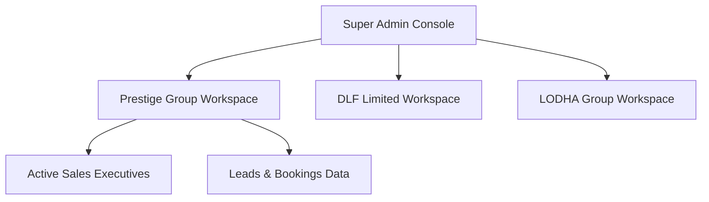

# Software Requirements Specification (SRS)
## Project: Builder CRM Enterprise Platform

---

## 1. Introduction & Scope

### 1.1 Document Purpose
This Software Requirements Specification (SRS) defines the functional, non-functional, business, and interface requirements for the **Builder CRM Enterprise Platform**. This document serves as the baseline for the engineering and development phases.

### 1.2 System Overview
Builder CRM is a premium, multi-tenant SaaS application tailored for Indian real estate developers and builders. It streamlines the lifecycle of property buyers, starting from inbound lead capture to site visits, negotiation, agreement execution, payment schedule tracking, sub-registrar registration, and broker performance tracking.

---

## 2. Multi-Tenant Architecture & User Roles

### 2.1 Multi-Tenancy Design
The application runs on a shared-application, isolated-database/schema tenant architecture:
- **Tenant Context**: Each builder group (e.g., Prestige Group, DLF Limited) operates within their designated sub-domain (e.g., `tenant.buildercrm.io`).
- **Resource Quotas**: System enforces hard limits on the number of user seats and database storage volumes.
- **Tenant Switcher**: Super Administrators can switch active tenant contexts dynamically from the top navigation bar to audit tenant workspaces.

### 2.2 User Roles & Permissions Matrix

| Module / Action | Super Admin | Tenant Admin (Relationship Manager) | Sales Executive |
|---|---|---|---|
| **Switch Workspace** | Yes | No | No |
| **Provision Tenants** | Yes | No | No |
| **System Audit Logs** | Yes | No | No |
| **Add/Edit Projects** | Yes | Yes | No |
| **Add/Convert Leads** | Yes | Yes | Yes |
| **Close/Lose Deals** | Yes | Yes | Yes |
| **Add Customer Profile** | Yes | Yes | No |
| **Configure SSO/Certificates**| Yes | No | No |

---

## 3. Screen-Wise Functional Specifications

### 3.1 App Shell (Layout Grid)
- **Left Sidebar**: 
  - Collapsible design (desktop wide: 260px, collapsed: 72px, mobile: hidden drawer menu).
  - Contains navigation elements with matching icons: *Dashboard, Leads Database, Active Customers, Closed Bookings, Lost Deals, Follow-ups, Analytical Reports, System Settings, Admin Console*.
- **Topbar**: 
  - Hamburger drawer button for mobile.
  - Active Tenant Selector (dropdown for workspace switching).
  - Dynamic breadcrumbs detailing the active route structure.
  - Global Search bar (Cmd+K / Ctrl+K trigger) searching across leads and customer databases.
  - Light/Dark mode switcher button.
  - Branding Style Palette select dropdown.
  - Notifications bell (triggers overlay listing alerts like overdue payments or new lead allocations).
  - User Avatar dropdown (triggers Account Settings and Log Out option).

---

### 3.2 Dashboard
- **Analytics Stat Cards**:
  - Displays: *Total Leads, Active Customers, Deals Closed, Deals Lost, Today's Follow-ups, Pending Site Visits, Monthly Sales, Cumulative Booking Portfolio*.
  - Trend markers (e.g., green up arrow with percentage improvement metrics).
- **Charts Section**:
  - *Sales Trend Chart*: Visual line chart mapping monthly sales revenue against set target lines.
  - *Lead Sources Doughnut*: Shows lead distribution percentages by channel.
- **Recent Action Tables**:
  - *Recent Inbound Leads*: Lists top 5 new leads. Clicking a row navigates to the Lead Profile.
  - *Upcoming Tasks*: Lists top 5 follow-up tasks with type tags.

---

### 3.3 Leads Database

#### 3.3.1 Leads Directory Table
- **Data Columns**: Lead ID, Registration Date, Customer Name, Mobile (+91), Project, Budget Scale, Source Channel, Sales Exec, Status Badge, Next Follow-up.
- **Filters**: Status Filter, Project Filter, Executive Filter.
- **Search Bar**: Real-time filtering by Name, Mobile, and ID.
- **Sorting**: Multi-column sorting by clicking headers.
- **Pagination**: Standard 10 records per page limit with page indicators.
- **CTAs**:
  - *Export Data*: Triggers CSV generation.
  - *Add New Lead*: Opens the modal creation wizard.

#### 3.3.2 Lead Profile Page
- **Summary Header**: Displays Customer Name, Lead ID, Date Registered, active Status.
- **CTAs**:
  - *Edit*: Edits profile metrics.
  - *Mark Lost*: Triggers Lost Reason popup modal.
  - *Convert to Customer*: Transitions the lead to the Active Customers list and updates their pipeline stage.
- **Information Panels**:
  - *Customer Info Card*: Complete contact card.
  - *Pipeline Stage Flow*: Horizontal indicator highlighting step index (New → Contacted → Qualified → Site Visit → Negotiation).
  - *Activity Timeline*: Chronological log of touchpoints.
  - *Interaction Notes (Remarks)*: List of RM/Executive notes.
  - *Scheduled Follow-ups*: Small grids displaying upcoming calls or meetings.

---

### 3.4 Active Customers

#### 3.4.1 Customers Directory Table
- **Data Columns**: Customer ID, Name, Contact, Assigned Project, Allocated Unit, Property Budget Value, Sales Executive, Current Stage.
- **CTAs**:
  - *Add Customer*: Opens the manual customer creation form.
  - *Export Portfolio*: Exports owner dataset.

#### 3.4.2 Customer Profile Page
- **Information Panels**:
  - *Personal Details*: Addresses and contacts.
  - *Property Allocation Details*: Renders Allocated Project, Unit Number, Specification Area (sq ft), Floor Level.
  - *SSO & Document Checklist*: Documents upload checklist.
  - *Relationship Manager Notes*: Interactive notes text area.
  - *Action CTA*: "View Agreement Booking" button routes directly to booking payment stages.

---

### 3.5 Closed Bookings (Deals Closed)
- **Directory Table**: Booking Reference Number, Customer Name, Project, Unit No, Slab Area, Booking Value, Token Amount, Selected Payment Plan, Agreement Status, Registration Status.
- **Booking Details View**:
  - Displays property dimensions and billing statistics.
  - *Payment Schedule Milestones*: Table detailing milestone ratios (excavation, plinth, superstructure, possession) with color-coded receipt status tags (*Paid, Overdue, Pending*).
  - *Legal Compliance Card*: Highlights Stamp Paper Executions, Registration Sub-registrar stamps, and Allotment Certificate issuance status.
  - *CTA*: "Update Legal Stage" button opens the status modal.

---

### 3.6 Lost Deals
- **Directory Table**: Lead Number, Customer Name, Project, Lost Date, Primary Lost Reason, Competitor Chosen, Sales Exec.
- **Visual Design**: Lost reasons are rendered in bright badge tags to identify trends (e.g., red for Budget, orange for Competitors).

---

### 3.7 Follow-ups Manager
- **Tabs Switcher**:
  - **List View**: Tabular grid of dates, customers, assigned sales executives, and status tags (Pending, Completed). Status tags are interactive and toggle status on click.
  - **Calendar View**: Monthly grid showing events as colored labels on date boxes. Clicking an event displays a detail toast alert.
  - **Timeline View**: Vertical scrollable list grouped by date, showing touchpoint cards.
- **CTA**: "Schedule Task" button triggers the task modal.

---

### 3.8 Analytical Reports
- **Reports Dashboard**:
  - Renders 3 mini charts: *Monthly Sales (Bar), Conversion by Channel (Pie), Executive Performance (Horizontal Bar)*.
  - Clicking any card expands it into a large, detailed chart container showing full comparative statistics.

---

### 3.9 System Settings
- **Configuration Sections (Tabs)**:
  - *Company Profile*: Corporate GSTIN, CIN, RERA ID, and registered office address details.
  - *Projects Directory*: Listing available units, pricing scales, and location maps.
  - *Sales Executives*: Manage executives designations, emails, and active account settings.
  - *Lead Channels*: List of channels with toggle switches.
  - *Property Types & Status Masters*: Configurable lists for BHK ranges and stages.

---

### 3.10 Super Admin Console
- **System Overview**: Large-scale charts detailing storage consumption per tenant builder, system operational uptime logs, and CPU loads.
- **Tenant Management**:
  - List of active tenants, subscription tier quotas, and database storage meters.
  - Detail Profile: Allows uploading branding color hex codes, configuring custom domains, and binding SAML SSO configurations.
- **Global System Logs**: Comprehensive timeline of user actions, timestamps, and IP addresses.
- **Global Settings**: Backups frequencies and file attachment size limits.

---

## 4. Key User Workflows & Business Rules

### 4.1 Lead-to-Customer Conversion Flow
When a user clicks "Convert to Customer" on a Lead Profile:
1. System validates that the lead email and mobile do not already exist in the customer database.
2. A new customer profile record is generated with a unique reference number (prefixed with `CUST-`).
3. The lead's status is updated to `Converted`.
4. The system logs a success audit event.
5. The interface routes the user to the newly created customer profile.

### 4.2 Booking Legal Progression Workflow
For a booking (closed deal), legal registration must progress through these stages:
- **Agreement Status**: `Pending` → `Executed`
- **Registration Status**: `Pending` → `Applied` → `Completed`
Only when both are marked `Executed` and `Completed` is the booking treated as legally closed for financial reporting.

### 4.3 Tenant Provisioning Workflow
Super Admin provisioning flow:
1. Enter builder group parameters (Company Name, Domain Code, Tier, RERA License, Contact details).
2. The domain is mapped dynamically: `[code].buildercrm.io`.
3. Resource quotas are allocated based on subscription limits:
   - *Basic*: 10 Users / 5 GB Storage.
   - *Professional*: 50 Users / 25 GB Storage.
   - *Enterprise*: 200 Users / 100 GB Storage.
4. A new workspace tenant record is registered, and an entry is logged in the system audit logs.

---

## 5. Field Validations & Inputs Constraints

| Form | Field | Constraint / Validation Rule |
|---|---|---|
| **Add Lead** | Customer Name | Required. Alphabetic characters only. |
| | Mobile Number | Required. Must match standard Indian format (+91 XXXXX XXXXX or 10-digit numeric). |
| | Email Address | Required. Valid email pattern validation. |
| | Budget | Required. Numeric input format. |
| **Mark Lost** | Lost Reason | Required select. Selected from list of master reasons. |
| | Competitor Name | Optional. Free text entry. |
| **Schedule Task**| Task Date | Required. Cannot be set to past dates. |
| **Add Tenant** | Domain Code | Required. Alphanumeric only, no spaces or special characters. |
| | RERA License | Required. Format: `RERA-[STATE]-[NUMBER]`. |

---

## 6. Non-Functional & Architecture Requirements

### 6.1 Performance & Rendering Constraints
- **Animation Framework**: Animations must rely on compositor threads (`opacity`, `transform`) to ensure smooth 60fps transitions.
- **Discrete Transitions**: Popovers and `<dialog>` modals must use `transition-behavior: allow-discrete` to animate between states.
- **Scroll Optimization**: Heavy scroll containers (e.g., list tables) must implement `content-visibility: auto` to minimize DOM paint times.

### 6.2 Browser Accessibility (a11y) & Fallbacks
- **Focus Routing**: Hash changes during SPA routing must programmatically focus the view's primary heading (`h1` or `h2`) using `tabindex="-1"` to prevent focus loss for screen readers.
- **Backdrop Fallbacks**: Modal backdrop clicks must support click-coordinate calculations for browsers (e.g., Safari) that do not yet support the native `closedby="any"` attribute.
- **Contrast Ratios**: Custom themes must ensure text contrast ratios satisfy WCAG 2.1 AA targets (minimum 4.5:1 ratio).

### 6.3 Security & Isolation
- **Tenant Isolation**: Active database operations must run with a tenant tenant-id filter to prevent cross-tenant leakages.
- **SSO Authentication**: Super Admin must enforce MFA flags and restrict custom domains mapping checkups.

---

## 7. Assumptions & Constraints
- **State Management**: The UI operates as a client-side prototype. It relies on standard browser storage (`localStorage`) to persist user settings, styling overrides, and mock tenant additions.
- **Data Initialization**: Every screen must load pre-populated datasets on boot to ensure a fully functional look and feel.
