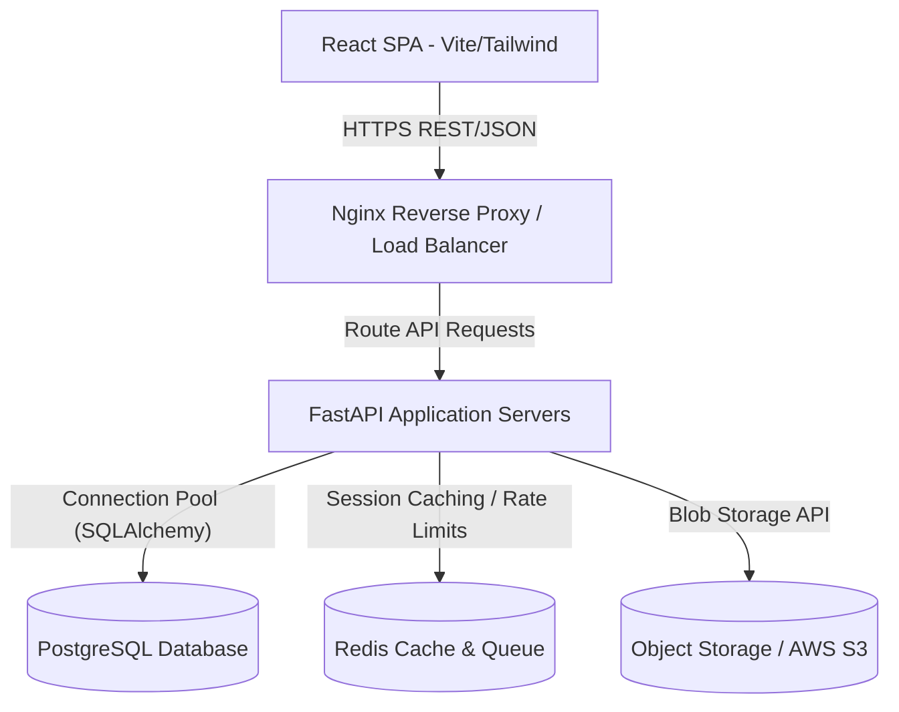
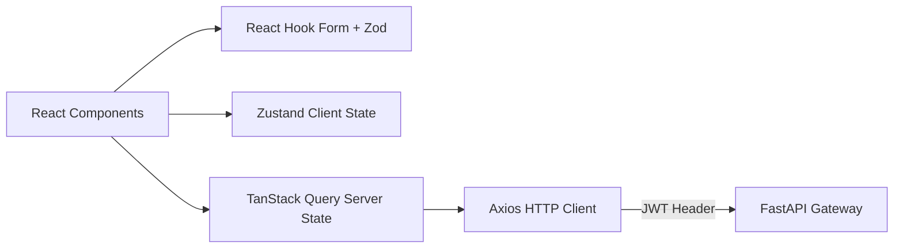
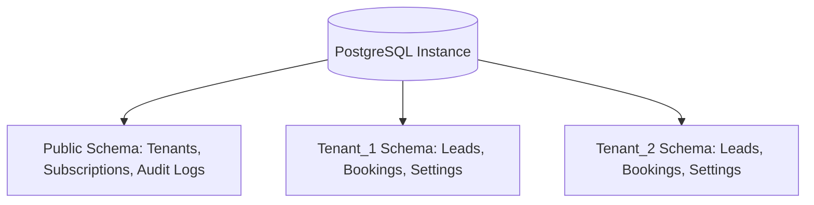
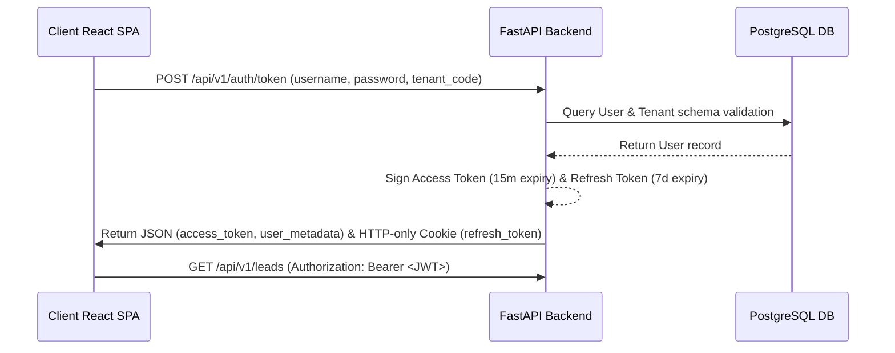
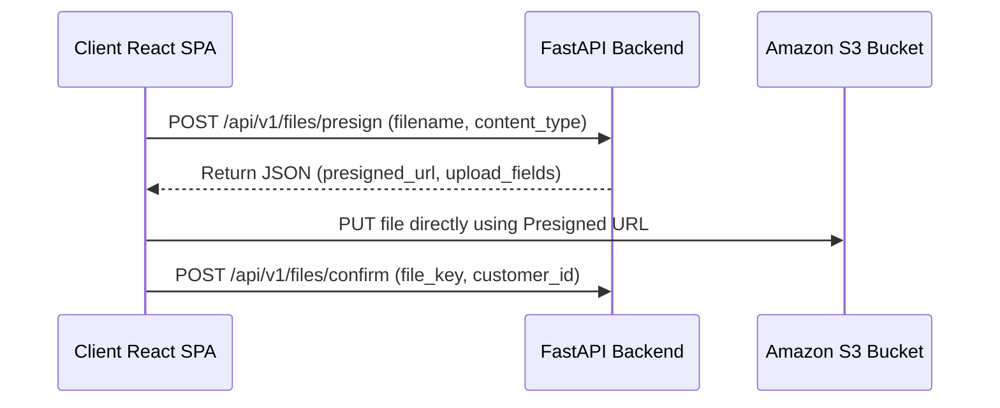
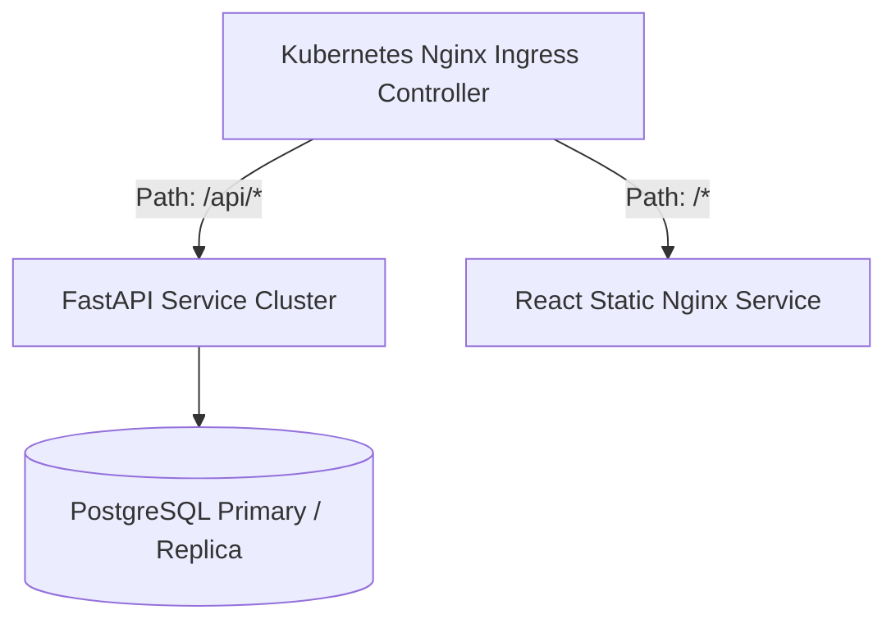

# Technical Architecture Document
## Project: Builder CRM Enterprise Platform
### Role: Solutions Architect Blueprint

---

## 1. Executive Summary & Solution Context
This document outlines the end-to-end technical architecture for the **Builder CRM Enterprise Platform**, a multi-tenant SaaS application tailored for the Indian real estate market. The design prioritizes strict data isolation, high concurrent performance, scalable API structures, and a modular frontend UI using React (Vite SPA), FastAPI (Python), and PostgreSQL.

---

## 2. Overall Solution Architecture

The solution uses a classic three-tier architecture with a decoupled client SPA and a stateless API gateway layer backed by a relational database system:



- **Client Tier**: React SPA built with Vite, Tailwind CSS, Zustand, and TanStack Query. Serving static assets via Nginx or Cloudflare CDN.
- **Application Tier**: Stateless FastAPI web servers running inside Docker containers, coordinated by Nginx, and managed by Gunicorn/Uvicorn workers.
- **Cache & Queue Tier**: Redis for rate limiting, session storage, and background task queues (Celery/ARQ).
- **Database Tier**: Highly available PostgreSQL database instance running with connection pooling.
- **Storage Tier**: Cloud object storage (S3/MinIO) for storing flat floorplans, booking documents, and RERA certificates.

---

## 3. Frontend Architecture

The client application is built as a single-page application (SPA) optimized for low bundle size, fast First Contentful Paint (FCP), and seamless state synchronization.

### 3.1 Key Technologies
- **Vite**: Build tool and bundler.
- **React (v18+)**: Component framework utilizing concurrent rendering.
- **Tailwind CSS**: Utility-first styling framework with design system configurations.
- **Zustand**: Lightweight, decoupled client-side state management.
- **TanStack Query (React Query)**: Server state synchronization, caching, and background revalidation.
- **React Router (v6)**: Declarative client-side routing.
- **React Hook Form + Zod**: High-performance form control with schema-based field validations.



---

## 4. Backend Architecture

FastAPI provides the high-performance, asynchronous REST API gateway layer. It utilizes Python's native `asyncio` capabilities to handle high concurrent user operations.

### 4.1 Key Design Principles
- **Asynchronous Handlers**: Use `async def` for I/O bound endpoints (database calls, file uploads).
- **Dependency Injection**: Use FastAPI's `Depends` system for auth guards, database session injections, and rate limiting.
- **Pydantic V2**: Strongly-typed requests/responses validation schemas.
- **SQLAlchemy (Async)**: Object Relational Mapper configured with async drivers (`asyncpg`) to avoid blocking thread pools.

---

## 5. Database Architecture & Multi-Tenancy

### 5.1 Multi-Tenant Isolation Strategy
Builder CRM implements **Schema-based Isolation** within a single PostgreSQL database instance to balance data security and operational costs:



- **Public Schema**: Contains master system metadata (`tenants`, `subscriptions`, `global_audit_logs`).
- **Tenant Schemas**: Each tenant has a dedicated PostgreSQL schema (`tenant_xxxx`). Database migration scripts run across all schemas using Alembic.
- **Connection Router**: API middleware extracts the tenant header (`X-Tenant-ID`) or sub-domain from incoming requests, sets the search path on the database session (`SET search_path TO tenant_xxxx`), and proceeds with the query.

### 5.2 Key Entity-Relationship (ER) Schema Layout
The core tables created across each tenant schema follow this relational model:

```sql
-- Core schemas mapping inside tenant schemas
CREATE TABLE leads (
    id VARCHAR(50) PRIMARY KEY,
    name VARCHAR(255) NOT NULL,
    email VARCHAR(255) NOT NULL,
    phone VARCHAR(20) NOT NULL,
    project_id VARCHAR(50) REFERENCES projects(id),
    budget NUMERIC(12, 2),
    source VARCHAR(100),
    sales_exec_id VARCHAR(50),
    status VARCHAR(50) NOT NULL,
    created_at TIMESTAMP WITH TIME ZONE DEFAULT CURRENT_TIMESTAMP,
    updated_at TIMESTAMP WITH TIME ZONE DEFAULT CURRENT_TIMESTAMP
);

CREATE TABLE customers (
    id VARCHAR(50) PRIMARY KEY,
    lead_id VARCHAR(50) REFERENCES leads(id),
    name VARCHAR(255) NOT NULL,
    email VARCHAR(255) NOT NULL,
    phone VARCHAR(20) NOT NULL,
    address TEXT,
    allocated_unit VARCHAR(100),
    budget NUMERIC(12, 2),
    assigned_exec_id VARCHAR(50),
    agreement_status VARCHAR(50) DEFAULT 'Agreement Pending',
    created_at TIMESTAMP WITH TIME ZONE DEFAULT CURRENT_TIMESTAMP
);

CREATE TABLE bookings (
    booking_no VARCHAR(50) PRIMARY KEY,
    customer_id VARCHAR(50) REFERENCES customers(id),
    project_id VARCHAR(50) REFERENCES projects(id),
    unit_no VARCHAR(50) NOT NULL,
    booking_value NUMERIC(12, 2) NOT NULL,
    token_amount NUMERIC(12, 2) NOT NULL,
    payment_plan_id VARCHAR(50),
    legal_status VARCHAR(50) DEFAULT 'Pending',
    created_at TIMESTAMP WITH TIME ZONE DEFAULT CURRENT_TIMESTAMP
);
```

---

## 6. Folder and Project Structure

The project uses a monorepo layout with clean separation between frontend, backend, and infrastructure scripts:

```
buildercrm-platform/
├── backend/
│   ├── app/
│   │   ├── api/             # API Router endpoints grouped by version (v1)
│   │   ├── core/            # Configuration, security constants, JWT helpers
│   │   ├── db/              # Session setup, base model, migrations configurations
│   │   ├── models/          # SQLAlchemy SQL models
│   │   ├── schemas/         # Pydantic schemas (Request/Response validation)
│   │   ├── services/        # Business logic controllers
│   │   └── main.py          # FastAPI Entry point
│   ├── migrations/          # Alembic migrations directory
│   ├── Dockerfile
│   └── requirements.txt
├── frontend/
│   ├── public/              # Static assets, logos
│   ├── src/
│   │   ├── assets/          # CSS stylesheets, branding SVG files
│   │   ├── components/      # Global shared UI components (Button, Input, Modal, Table)
│   │   ├── config/          # API Constants, route configs
│   │   ├── hooks/           # Custom React hooks, TanStack Query hooks
│   │   ├── layouts/         # App layouts (DashboardLayout, AdminLayout, AuthLayout)
│   │   ├── pages/           # Screen views (Dashboard, Leads, Customers, Settings)
│   │   ├── store/           # Zustand stores (authStore, tenantStore, uiStore)
│   │   ├── utils/           # Helper methods (formatting currency, dates)
│   │   ├── App.tsx
│   │   └── main.tsx
│   ├── tailwind.config.js
│   ├── vite.config.ts
│   └── package.json
└── docker-compose.yml
```

---

## 7. Component Hierarchy & Module-wise Architecture

```
App.tsx (Router, QueryClientProvider)
└── MainLayout
    ├── Sidebar (Collapsible navigation, collapsible controls)
    └── Header (Breadcrumbs, Tenant Context Selector, Style Selector, Profile Dropdown)
        └── Page Container
            ├── Dashboard Page
            │   ├── StatCard Grid
            │   ├── LineChart (Sales Volume)
            │   └── DoughnutChart (Source Lead Splits)
            ├── Leads Page
            │   ├── LeadsTable (Search, Pagination, Headers Sorting)
            │   └── LeadDetails View
            │       ├── PipelineIndicator (Timeline steps)
            │       ├── TimelineHistory (Audit changes list)
            │       └── NotesArea
            └── Customers Page
                ├── CustomersTable
                └── CustomerRegistration Modal
```

---

## 8. Routing Strategy & Route Guarding

We implement Client-Side Routing using `react-router-dom` (v6) with declarative route protection matching user roles (RBAC):

```tsx
// Routing Setup with Guards
import { Navigate, Route, Routes } from 'react-router-dom';
import { useAuthStore } from '../store/authStore';

const ProtectedRoute = ({ children, allowedRoles }: { children: React.ReactNode, allowedRoles?: string[] }) => {
  const { isAuthenticated, userRole } = useAuthStore();
  
  if (!isAuthenticated) {
    return <Navigate to="/login" replace />;
  }
  
  if (allowedRoles && !allowedRoles.includes(userRole)) {
    return <Navigate to="/unauthorized" replace />;
  }
  
  return <>{children}</>;
};

export const AppRoutes = () => (
  <Routes>
    <Route path="/login" element={<Login />} />
    <Route path="/" element={<ProtectedLayout />}>
      <Route path="dashboard" element={<ProtectedRoute><Dashboard /></ProtectedRoute>} />
      <Route path="leads" element={<ProtectedRoute><Leads /></ProtectedRoute>} />
      <Route path="customers" element={<ProtectedRoute><Customers /></ProtectedRoute>} />
      <Route path="admin" element={<ProtectedRoute allowedRoles={['Super Admin']}><AdminConsole /></ProtectedRoute>} />
    </Route>
  </Routes>
);
```

---

## 9. State Management Strategy

We maintain clean separation between **Client State** (routing, UI themes, sidebar toggles) and **Server State** (database queries, lead listings).

- **Client State (Zustand)**: Fast, transient state that does not need querying APIs on changes:
  - `authStore`: Access tokens, user identity metadata, and logout operations.
  - `tenantStore`: Active tenant metadata, workspace configuration parameters, and styling overrides.
  - `uiStore`: Sidebar collapse states, notifications list overlays, search panels.
- **Server State (TanStack Query)**: Cached, fresh API responses:
  - Cache configurations: `staleTime: 5 * 60 * 1000` (5 minutes) for static references, `staleTime: 0` for real-time lead tables.

---

## 10. API Integration Strategy

We configure an Axios instance intercepting calls to inject tenant headers and JWT parameters dynamically:

```typescript
import axios from 'axios';
import { useAuthStore } from '../store/authStore';
import { useTenantStore } from '../store/tenantStore';

export const apiClient = axios.create({
  baseURL: import.meta.env.VITE_API_BASE_URL,
  headers: {
    'Content-Type': 'application/json',
  },
});

apiClient.interceptors.request.use((config) => {
  const token = useAuthStore.getState().token;
  const activeTenantId = useTenantStore.getState().activeTenantId;

  if (token) {
    config.headers.Authorization = `Bearer ${token}`;
  }
  if (activeTenantId) {
    config.headers['X-Tenant-ID'] = activeTenantId;
  }
  return config;
});
```

---

## 11. Authentication & Authorization Flow

We implement standard JWT token auth workflows with HTTP-Only Cookie or Secure Storage tokens storage:



- **MFA Compliance**: Super Admin accounts require secondary verification steps.
- **Token Refresh**: Axios interceptor listens for `401 Unauthorized` responses and fires a `/auth/refresh` request silently using the HTTP-Only cookie.

---

## 12. Error Handling & Form Validations

### 12.1 Client-Side Boundary Controls
- **React Error Boundaries**: Wrap the page router context to prevent application crashes on render exceptions.
- **HTTP Interceptor Catching**: Handle `403 Forbidden`, `404 Not Found`, and `500 Server Error` globally by displaying toast notifications.

### 12.2 Form Validation (React Hook Form + Zod)
Forms use schema validation before sending requests to the API:

```typescript
import { zodResolver } from '@hookform/resolvers/zod';
import { useForm } from 'react-hook-form';
import { z } from 'zod';

const leadSchema = z.object({
  name: z.string().min(3, 'Name must have at least 3 characters'),
  phone: z.string().regex(/^\+91\s\d{5}\s\d{5}$/, 'Must match format: +91 XXXXX XXXXX'),
  email: z.string().email('Invalid email pattern'),
  budget: z.number().positive('Budget must be positive'),
});

type LeadFormValues = z.infer<typeof leadSchema>;

export const AddLeadForm = () => {
  const { register, handleSubmit, formState: { errors } } = useForm<LeadFormValues>({
    resolver: zodResolver(leadSchema),
  });

  const onSubmit = (data: LeadFormValues) => {
    // tanstack query mutate action
  };
  
  // Render Form Inputs...
};
```

---

## 13. File Upload/Download Architecture

To avoid blocking the async FastAPI web servers, file uploads bypass streaming buffers:



- **Presigned URLs**: Direct uploads to S3 objects.
- **Downloads**: Private attachments are served using short-duration (15m expiry) GET presigned URLs to maintain access control.

---

## 14. Reporting & Charts Architecture
To ensure high responsiveness:
- **Client Side (Recharts)**: Render dashboard charts inside canvas elements with `responsiveContainer`. Rendered data arrays are pre-aggregated on the server to prevent heavy computations in the browser main thread.
- **Server Side**: Reports execute aggregate queries against indexed database fields. High-overhead reports compile asynchronously via Redis workers and compile results to JSON blobs or CSV cache layers.

---

## 15. Logging, Audit Trails & Monitoring

- **Application Logs (FastAPI)**: Configured with `loguru` formatters outputting JSON format to standard output. Collected by fluentd / vector containers.
- **System Audit Logs**: All state-changing events (e.g. workspace switching, lead status mutations) are written to a central SQL `audit_logs` table containing the User ID, Tenant ID, timestamp, and client IP.
- **Metrics Monitoring**: Prometheus scrapes endpoints from FastAPI application runtimes (`/metrics`), capturing request execution latency and database pool utilization. Visualized in Grafana.

---

## 16. Security Best Practices (OWASP Top 10)

- **SQL Injection Prevention**: Enforced by using SQLAlchemy parameter bindings. Direct string building in queries is forbidden.
- **CORS Config**: REST API configures explicit, whitelisted tenant URL parameters (e.g., `https://*.buildercrm.io`). Wildcard configurations (`*`) are disallowed.
- **CSRF Protection**: Access tokens are stateless headers. Refresh tokens in cookies are secured with `Secure`, `HttpOnly`, and `SameSite=Strict` policies.
- **Content Security Policy (CSP)**: Nginx configures CSP headers to restrict inline script executions and allow asset queries ONLY to CDNs and verified APIs.

---

## 17. Performance & Scalability Strategy

- **Database Indexing**: Create indices on query keys: `CREATE INDEX idx_leads_tenant_status ON leads (status);`
- **Connection Pooling**: Uses pgBouncer to queue connection allocations and prevent database thread exhausts during high-frequency API calls.
- **CDN Caching**: Route asset requests (fonts, vendor bundles, images) through Cloudflare CDN edges.
- **React Lazy-Loading**: Split pages using dynamic imports to optimize JS bundles:
  ```typescript
  const LeadsPage = React.lazy(() => import('./pages/Leads'));
  ```

---

## 18. Coding Standards & Style Conventions
- **TypeScript**: Enforced across the React application (`strict: true`). No explicit `any` parameters.
- **Formatting**: Automated checkups using ESLint paired with Prettier format patterns.
- **Commit Linting**: Commit messages follow Conventional Commit guidelines (`feat:`, `fix:`, `docs:`, `chore:`).

---

## 19. Recommended Third-Party Libraries

| Dependency | Purpose | Target Tier |
|---|---|---|
| **Zustand** | Global client-state storage | Frontend |
| **TanStack Query** | Server state caching and mutations | Frontend |
| **React Hook Form** | Controlled form bindings | Frontend |
| **Recharts** | Vector rendering visualizations | Frontend |
| **Pydantic V2** | JSON request/response schema parsing | Backend |
| **SQLAlchemy (Async)** | Database mapping layers | Backend |
| **asyncpg** | High-speed postgres drivers | Backend |
| **Alembic** | Multi-schema migration tracking | Backend / DB |

---

## 20. Deployment & Environment Configuration

### 20.1 Deployment Architecture (Containerized Orchestration)
The system is built to deploy inside containerized environments (Kubernetes or AWS ECS):



### 20.2 Environment Settings
- **Development**:
  - Dev server: `Vite HMR` running locally on port `5173`.
  - API server: Local `uvicorn --reload` running on port `8000`.
  - Database: Local docker-compose PostgreSQL instance.
- **Production**:
  - Static files compiled using `npm run build` and served from Nginx.
  - FastAPI running multiple Uvicorn worker processes managed by Gunicorn.
  - Multi-zone replication configurations on database clusters.
